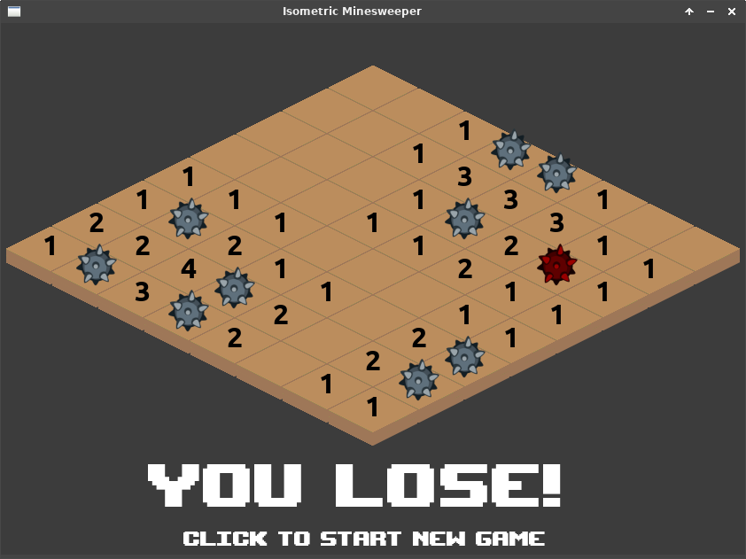

# Isometric Minesweeper
Minesweeper in isometric view, written in C++ / SDL2.

## Dependencies
SDL2
SDL2_image

## Compile (linux)
sh compile.sh

## Run
./bin/isometric-minesweeeper

## Screenshots

## Blog Post (Polish only)
[Izometryczny Saper w C++ SDL2](https://programisty-dzien-powszedni.pl/gra-saper-w-wersji-izometrycznej-w-c-i-sdl2)
